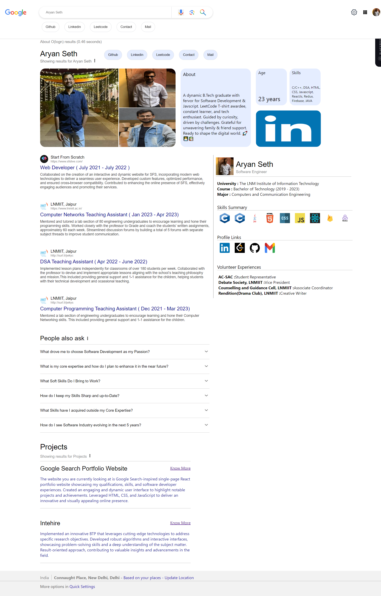

# Google Search Portfolio - A Single-Page React Portfolio Website



The **Google Search Portfolio** is an innovative and eye-catching single-page React portfolio website, inspired by the layout and design of Google Search pages. This project showcases my qualifications, skills, project links, and software developer experiences, presenting all the essential details that can be found in a resume.

## Features

- **Google Search-Inspired Design:** The website's clean and intuitive layout mimics the familiar look of Google Search pages, providing a unique and engaging user experience.

- **Single-Page Application:** Users can seamlessly navigate through all the content without having to reload the page, enhancing accessibility and convenience.

- **Qualifications & Skills:** The portfolio highlights my qualifications and skills, offering potential employers valuable insights into my expertise and capabilities.

- **Project Links:** It includes direct links to my notable projects, enabling easy access to view my work and contributions.

- **Software Developer Experiences:** The website showcases my experiences as a software developer, outlining the various roles and responsibilities I have undertaken throughout my career.

## Technologies Used

- **React:** The project is built using the powerful and popular React library, ensuring efficient component-based development and a smooth user interface.

- **HTML & CSS:** The use of HTML and CSS provides a solid foundation for the website's structure and visually appealing design.

- **JavaScript:** The application's interactive elements and dynamic features are implemented using JavaScript.

## Live Demo

Experience the live version of the Google Search Portfolio at [Live Demo](https://aryan-seth-28.netlify.app/).

## Motivation

This project serves as a testament to my passion for web development and showcases my ability to combine creativity with technical skills to create a visually captivating and functional portfolio.

## Installation & Usage

To explore the project locally or make further enhancements, follow these simple steps:

1. Clone the repository:

```bash
git clone https://github.com/aryan-prog/google-portfolio.git
cd google-portfolio
```

2. Install dependencies:

```bash
npm install
```

3. Start the development server:

```bash
npm start
```

4. Open your web browser and visit [http://localhost:3000](http://localhost:3000) to view the portfolio website.

## Contribution

I welcome any contributions, feedback, or suggestions to enhance this project further. If you encounter any issues or have ideas for improvement, please don't hesitate to create an issue or submit a pull request.


The **Google Search Portfolio** exemplifies my dedication to presenting my skills and experiences in a creative and engaging manner. I hope this project provides a comprehensive and impressive representation of my capabilities as a software developer. Thank you for visiting my portfolio website! If you have any questions or would like to get in touch, please feel free to contact me at [seth.aryan605@gmail.com](mailto:seth.aryan605@gmail.com). Happy coding!